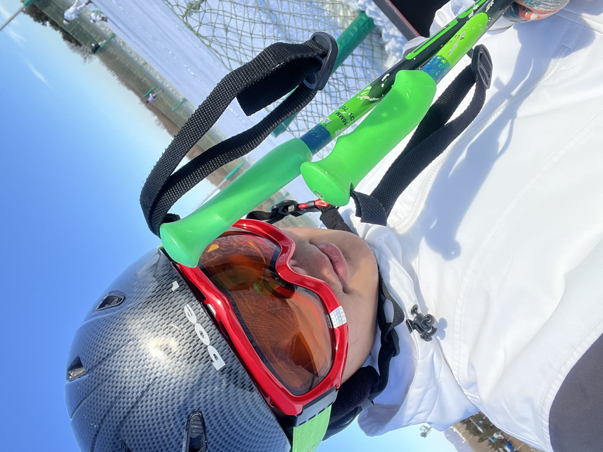

:::: {.columns}

::: {.column width="65%"}

# Hi, I'm Yuhan Wu — call me Max.

I'm an undergraduate at **Emory University** (Class of 2028) interested in the intersection of data, biology, and decision-making. I work across statistical modeling, bioinformatics, and quantitative analysis — building toward careers in both research and industry.

 

[View Projects](projects.qmd){.btn .btn-outline-dark .btn-sm}
[About Me](about.qmd){.btn .btn-outline-dark .btn-sm}
[GitHub](https://github.com/UhanWu){.btn .btn-outline-dark .btn-sm}
[LinkedIn](https://linkedin.com/in/wuyuhanm){.btn .btn-outline-dark .btn-sm}

:::

::: {.column width="5%"}
:::

::: {.column width="30%"}

{.rounded-circle width="100%" style="max-width: 260px;"}

:::

::::

---

## Areas of Work

::: {.grid}

::: {.g-col-6}
### 🧬 Biostatistics & Bioinformatics
Statistical analysis of biological and clinical data. Projects span survival analysis, genomic data workflows, and epidemiological modeling — with an eye toward PhD-level research in computational biology or biostatistics.
:::

::: {.g-col-6}
### 📐 Mathematical & Statistical Modeling
Rigorous quantitative modeling applied to real-world problems. Competed in **7 math modeling
competitions** (3× HiMCM, 2× IMMC, 2× MTFC), co-founded Newton North's Math Modeling Club,
and presented at the **2023 Joint Mathematics Meeting** in Boston, MA.

- **HiMCM** — Meritorious (2021) & Finalist (2023), issued by COMAP
- **IMMC** — USA National Finalist (2022 & 2024), issued by COMAP

Competition papers:
[HiMCM 2021](assets/papers/YWu_HIMCM2021.pdf) · 
[HiMCM 2022](assets/papers/YWu_HiMCM2022.pdf) · 
[HiMCM 2023](assets/papers/YWu_HiMCM2023.pdf) · 
[IMMC 2022](assets/papers/YWu_IMMC2022.pdf) · 
[IMMC 2024](assets/papers/YWu_IMMC2024.pdf)
:::

::: {.g-col-6}
### 💼 Business & Quantitative Case Studies
Quantitative approaches to structured problems — risk modeling, data-driven strategy, and
applied statistics. Adaptable to consulting, actuarial, and policy contexts.

**Modeling the Future Challenge** (Actuarial Foundation) — NE Regional **#1** (2023),
National Finalist (2023 & 2024)

Actuarial modeling papers:
[MTFC 2023](assets/papers/YWu_MTFC2023.pdf) · 
[MTFC 2024](assets/papers/YWu_MTFC2024.pdf)

**Anchors Against Food Deserts** — gravity-weighted demand surface model identifying
"hero stores" critical to Atlanta's fresh food network, built for Invest Atlanta using
GeoPandas, Folium, and kernel density estimation.
[View Poster](assets/papers/Group2AIdatalab_Poster.pdf)

*Earlier work: [Housing Fluctuation & the Case-Shiller Index](https://uhanwu.github.io/HousingPrep/) —
analyzing single-family home price trends across Boston, NYC, and San Francisco (2001–2021)
using housing supply, median income, and population as explanatory factors. Built in R.*
:::

::: {.g-col-6}
### 🛠 Tools & Reproducible Research
R, Python, Quarto, and Shiny for end-to-end reproducible analysis. I care about clean code,
clear documentation, and results others can verify and build on.

[Bro's Statistical Analyzer](https://yuhanwuw.shinyapps.io/bros-statsanalyzer/) —
an R Shiny app with a full UI for data ingestion, transformation (pivot, aggregate, reshape), 
11 statistical tests (normality, t-tests, ANOVA, Wilcoxon, chi-square, Fisher's exact), 
and 6 `ggplot2` visualization types with reproducible code output.
:::

:::

---

*Currently open to research opportunities, internships, and collaborations.*